## Chatbot ou agente {.center}

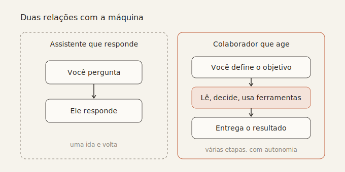{width="80%"}

## Do Chat ao Cowork e ao Code {.center}

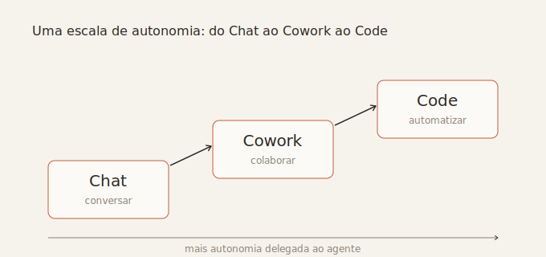{width="80%"}

##  {.center}

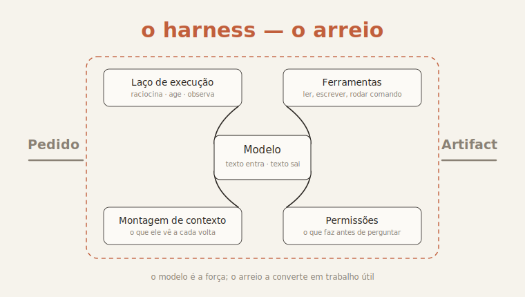{width="78%"}

<!-- 5 · Cowork no Desktop -->
##  {.center}

::: {.tela-rotulada}
::: {.rotulo-vert}
Claude Cowork no Desktop
:::
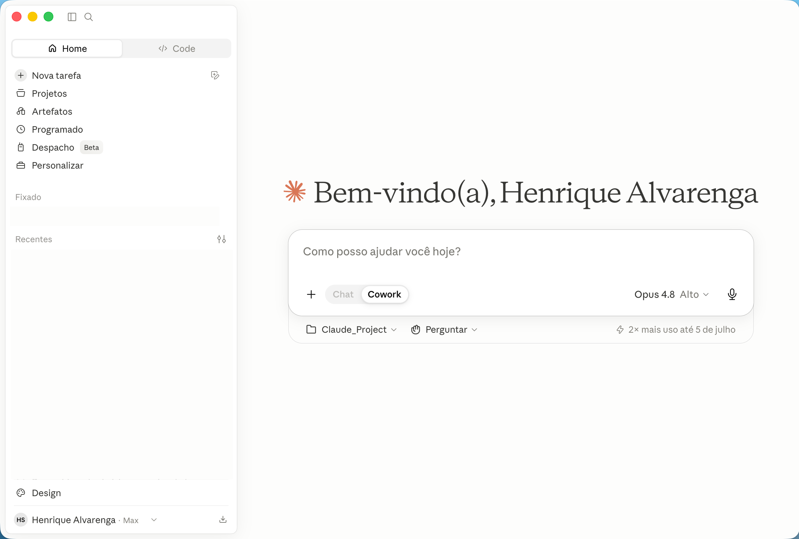{.tela}
:::

<!-- 6 · Code no Desktop -->
##  {.center}

::: {.tela-rotulada}
::: {.rotulo-vert}
Claude Code no Desktop
:::
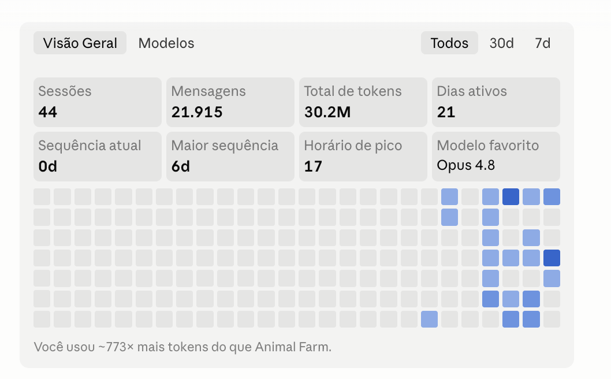{.tela}
:::

<!-- 7 · Code no Positron -->
##  {.center}

::: {.tela-rotulada}
::: {.rotulo-vert}
Claude Code no Positron
:::
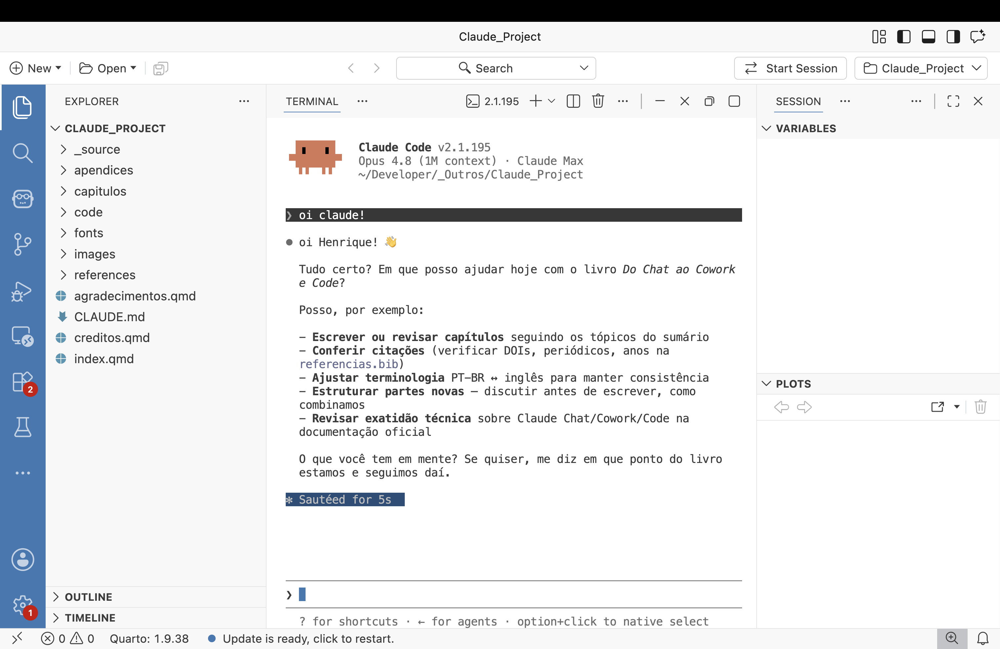{.tela}
:::

<!-- 8 · Code no Terminal -->
##  {.center}

::: {.tela-rotulada}
::: {.rotulo-vert}
Claude Code no Terminal
:::
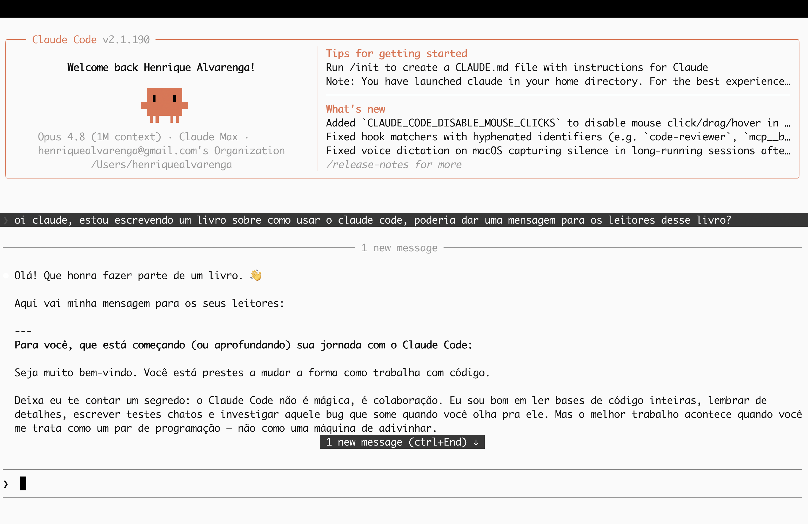{.tela}
:::

<!-- 9 · Google -->
## O Google também lançou um Agente {.center}

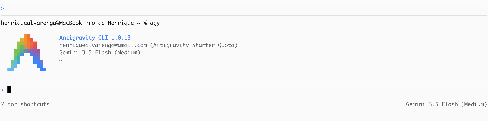{.tela width="80%"}

<!-- 10 · OpenAI -->
## A OpenAI também lançou um Agente {.center}

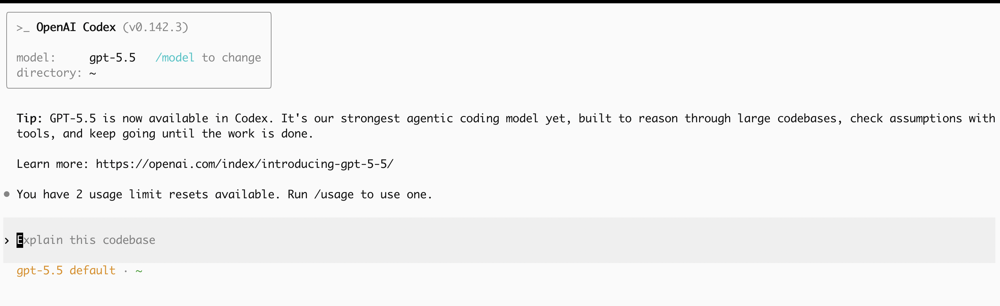{.tela width="80%"}

<!-- 11 · Conectores / menu -->
##  {.center}

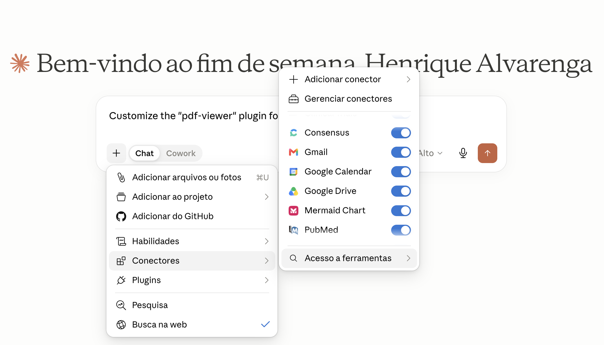{.tela width="78%"}

<!-- 12 · O que é vibe coding -->
## O que é Vibe Coding?

<div class="cartoes">
  <div class="cartao"><span class="rotulo">Você descreve</span><span class="destaque">Prompt</span></div>
  <div class="seta-h">→</div>
  <div class="cartao"><span class="rotulo">IA escreve</span><span class="destaque">Código</span></div>
</div>

::: {.sub}
Código funcional, pronto para executar.
:::

<!-- ============================================================= -->
<!-- PARTE 1 — VIBE CODING NO ENSINO                               -->
<!-- ============================================================= -->

##  {.center}

::: {.divisor}
[1.]{.num}

[Vibe Coding no Ensino]{.titulo-grande}
:::

<!-- 14 · artigo Medical Teacher -->
## De usuários de tecnologia a criadores {.center}

::: {.sub}
O uso de vibe coding na transformação do ensino e da aprendizagem clínica.
:::

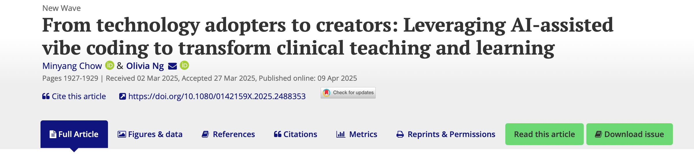{.tela width="82%"}

::: {.fonte-citacao}
Chow, M., & Ng, O. (2025). From technology adopters to creators: Leveraging AI-assisted vibe coding to transform clinical teaching and learning. *Medical Teacher, 47*(12), 1927–1929. https://doi.org/10.1080/0142159X.2025.2488353
:::

<!-- 15 · as duas aplicações -->
##  {.center}

{.tela width="66%"}

Aplicamos essa abordagem (VIBE CODING) para desenvolver **duas aplicações distintas**:

- *The Differential Diagnosis Trainer* (DDT)
- *Insulin and Blood Sugar Simulation* (IBSS)

::: {.sub}
Ambas construídas com plataformas *no-code* com IA.
:::

::: {.fonte-citacao}
Chow, M., & Ng, O. (2025). *Medical Teacher, 47*(12), 1927–1929. https://doi.org/10.1080/0142159X.2025.2488353
:::

<!-- 16 · App Store -->
##  {background-image="img/appstore-busca.png" background-size="contain" background-color="#ffffff"}

<!-- 17 · Bounded Rationality -->
##  {background-image="img/app-bounded-rationality.png" background-size="cover" background-color="#26211D"}

<!-- 18 · Linear Regression Lab -->
##  {background-image="img/app-linear-regression.png" background-size="cover" background-color="#26211D"}

<!-- 19 · virada -->
## Vibe Coding no Ensino {.center}

::: {.seta-baixo}
↓
:::

::: {.frase style="font-size:1.2em;"}
Podemos criar nossos próprios apps!
:::

<!-- ============================================================= -->
<!-- PARTE 2 — VIBE CODING NA PESQUISA                             -->
<!-- ============================================================= -->

##  {.center}

::: {.divisor}
[2.]{.num}

[Vibe Coding na Pesquisa]{.titulo-grande}
:::

<!-- 21 · artigo Schizophrenia -->
##  {.center}

::: {.faixa-titulo}
Schizophrenia · 2025
:::

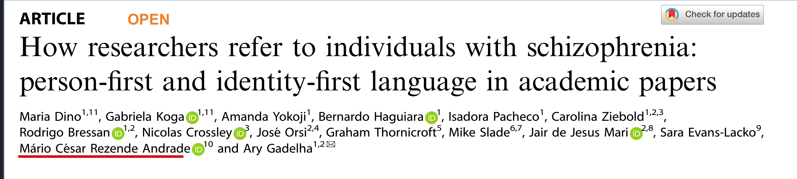{.tela width="82%"}

::: {.frase style="font-size:1.05em; margin-top:.5em;"}
O desafio era encontrar determinados termos em centenas de artigos no formato PDF.
:::

::: {.fonte-citacao}
Dino, M., Koga, G., Yokoji, A. et al. How researchers refer to individuals with schizophrenia: person-first and identity-first language in academic papers. *Schizophr 11*, 146 (2025). https://doi.org/10.1038/s41537-025-00692-0
:::

<!-- 22 · materials and methods -->
## Materials and Methods {.center}

::: {.quote-livre}
“We developed a keyword-finding software with the assistance of ChatGPT to extract data, using Python programming language and the PyCharm platform. The code was designed to read PDF files and conduct a scan to recognize specified keywords along with their contextual…”
:::

::: {.fonte-citacao}
Dino, M., Koga, G., Yokoji, A. et al. *Schizophr 11*, 146 (2025). https://doi.org/10.1038/s41537-025-00692-0
:::

<!-- 23 · virada -->
## Vibe Coding na Pesquisa {.center}

::: {.seta-baixo}
↓
:::

::: {.frase style="font-size:1.15em;"}
Podemos criar nossos próprios apps<br>para pesquisa científica.
:::

<!-- ============================================================= -->
<!-- PARTE 3 — VIBE CODING NA ANÁLISE DE DADOS                     -->
<!-- ============================================================= -->

##  {.center}

::: {.divisor}
[3.]{.num}

[Vibe Coding na análise de dados]{.titulo-grande}
:::

<!-- 25 · Problemas -->
## Problemas

::: {.bloco-num}
[1]{.n}
Softwares estatísticos são **caros** (SPSS, SAS, Minitab). Cada pesquisador usa o seu — e fica preso ao ecossistema do software.
:::

::: {.bloco-num}
[2]{.n}
Copiar e colar entre programas dá trabalho e **insere erros**. Toda mudança na análise refaz resultados, tabelas, gráficos e a numeração.
:::

<!-- 26 · Consequência -->
##  {background-image="img/softwares-estatisticos.png" background-size="contain" background-color="#26211D"}

<!-- 27 · Solução 1 -->
## Solução 1

Pacotes estatísticos **gratuitos** e *open-source* — como **R** ou **Python** — poderiam ser a solução.

::: {.sub}
Mas tinham uma curva de aprendizado grande: era preciso aprender a escrever código.
:::

<!-- 28 · Solução 1 -->
## Solução 1 {.center}

::: {.frase}
A IA pode escrever<br>os códigos.
:::

<!-- 29 · agentes de IA -->
## Agentes de IA para escrever os códigos {.center}

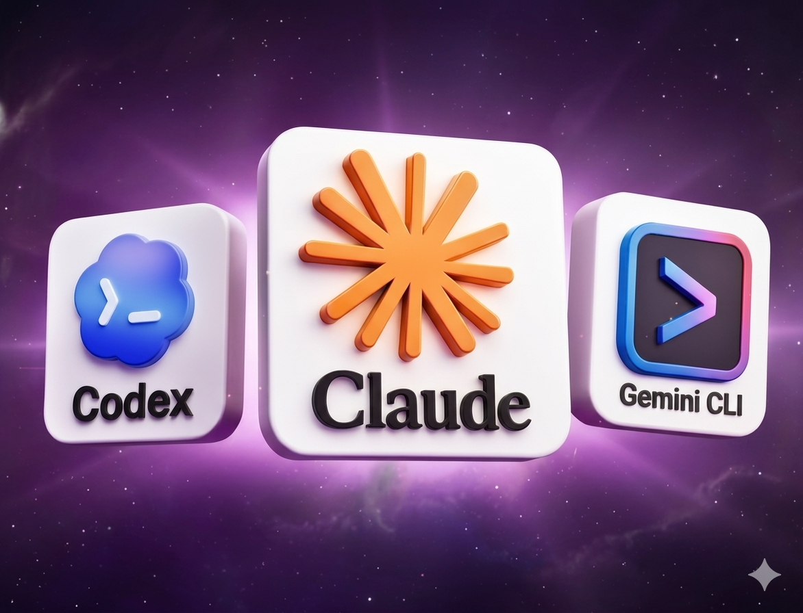{.tela width="62%"}

<!-- 30 · prompt → código -->
##  {.center}

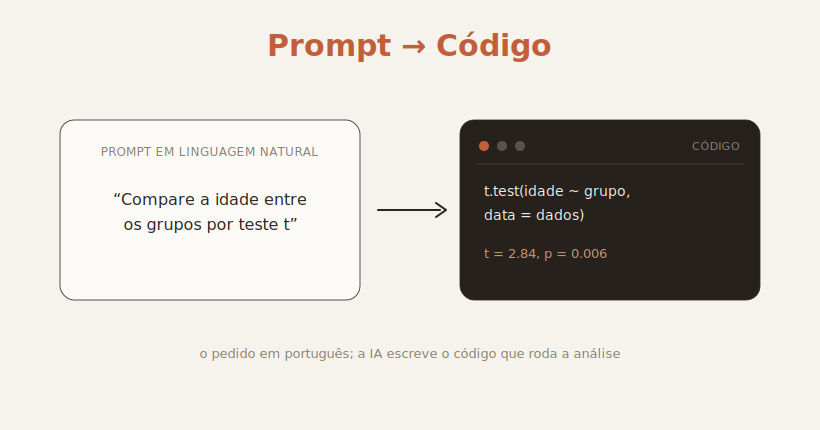{width="82%"}

<!-- 31 · Problema 2 -->
## Problema 2

::: {.bloco-num}
[2]{.n}
Copiar e colar entre programas dá trabalho e insere erros. Toda mudança na análise muda todos os resultados, tabelas, gráficos, a sequência de numeração etc.
:::

<!-- 32 · fluxo tradicional -->
##  {.center}

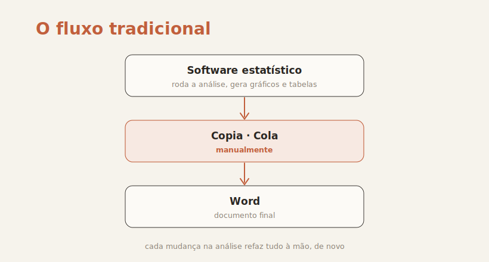{width="76%"}

<!-- 33 · retrabalho 1 -->
##  {.center}

::: {.frase}
“Refaça tirando os menores de 18.”
:::

::: {.sub}
Uma única mudança desencadeia horas de retrabalho. Toda a análise precisa ser refeita.
:::

::: {.aviso}
⚠ Uma mudança de critério **= retrabalho total** no fluxo tradicional.
:::

<!-- 34 · retrabalho 2 -->
##  {.center}

::: {.frase}
“Insira mais uma tabela e um gráfico nos resultados.”
:::

::: {.sub}
Muda toda a numeração das tabelas e dos gráficos.
:::

::: {.aviso}
⚠ Uma mudança **= retrabalho total** no fluxo tradicional.
:::

<!-- 35 · Solução 2 -->
## Solução 2

E se a **análise passasse a ser o próprio documento**? Código, texto e resultado coexistindo no mesmo arquivo — e a mudança na análise se propagando sozinha para todas as tabelas e parágrafos.

::: {.quote-livre style="margin-top:.7em;"}
Não há cópia. Não há cola.<br>O documento **é** a análise.
:::

<!-- 36 · Quarto site -->
##  {background-image="img/quarto-site.png" background-size="contain" background-color="#0d1117"}

<!-- 37 · Quarto (4 cartões) -->
## Quarto

O Quarto une **texto, código e saída** num único arquivo. Quando o código roda, o documento se atualiza — automaticamente.

<div class="cartoes grade-2x2">
  <div class="cartao"><span class="destaque">Texto</span><span class="desc">Markdown</span></div>
  <div class="cartao"><span class="destaque">Código</span><span class="desc">R ou Python executando a análise</span></div>
  <div class="cartao"><span class="destaque">Referências</span><span class="desc">BibTeX e estilos com CSL</span></div>
  <div class="cartao"><span class="destaque">Tabelas e gráficos</span><span class="desc">gerados pelo código</span></div>
</div>

<!-- 38 · Anatomia de um .qmd -->
## Anatomia de um `.qmd`

<div class="camadas">
  <div class="camada"><span class="n">1</span><div class="corpo"><span class="rot">YAML · metadados</span><pre>---
title: "Estudo de coorte"
---</pre></div></div>
  <div class="camada"><span class="n">2</span><div class="corpo"><span class="rot">Texto · Markdown</span><pre>## Resultados
A média de idade foi:</pre></div></div>
  <div class="camada"><span class="n">3</span><div class="corpo"><span class="rot">Código que executa</span><pre>```{r}
mean(dados$idade)
```</pre></div></div>
</div>

<!-- 39 · quatro peças -->
## O que se junta em volta

<div class="cartoes grade-2x2">
  <div class="cartao"><span class="destaque">Quarto</span><span class="desc">formato de documento científico</span></div>
  <div class="cartao"><span class="destaque">IDE</span><span class="desc">ambiente de desenvolvimento</span></div>
  <div class="cartao"><span class="destaque">Agentes de IA</span><span class="desc">Claude Code/Cowork, Codex, Gemini CLI</span></div>
  <div class="cartao"><span class="destaque">Configuração</span><span class="desc">BibTeX e CSL para referências</span></div>
</div>

<!-- 40 · qual IDE -->
## Qual IDE para usar o Quarto? {.center}

<!-- 41 · Positron logo -->
## IDE ideal para Quarto em Data Science {.center}

{width="52%"}

<!-- 42 · Code no Positron -->
##  {.center}

::: {.tela-rotulada}
::: {.rotulo-vert}
Claude Code no Positron
:::
{.tela}
:::

<!-- 43 · Positron welcome -->
##  {background-image="img/positron-welcome.png" background-size="contain" background-color="#1e1e1e"}

<!-- 44 · Positron editando .qmd -->
##  {background-image="img/positron-editando-qmd.png" background-size="contain" background-color="#1e1e1e"}

<!-- 45 · site publicado -->
##  {background-image="img/site-vibe-coding.png" background-size="contain" background-color="#0d1117"}

<!-- 46 · uma fonte, várias saídas -->
##  {.center}

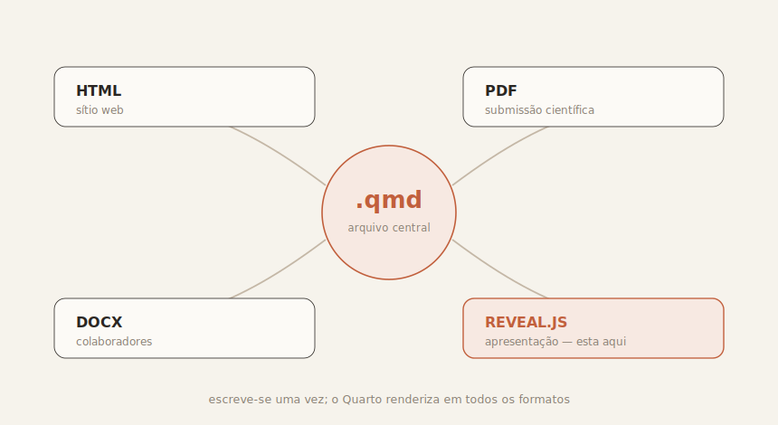{width="82%"}
